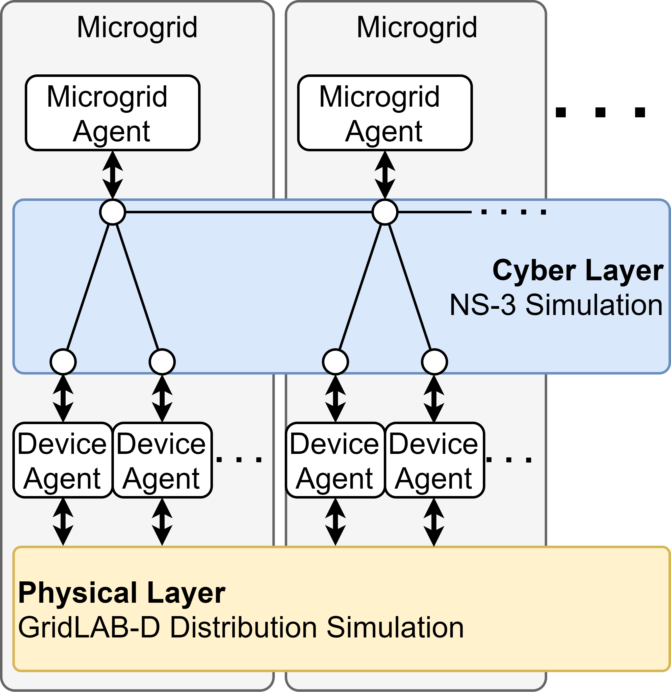

[//]: # (<!-- pandoc Co-Sim_CA.md --citeproc -o Co-Sim_CA.pdf -->)

[//]: # (<!-- # Platform for Cyber-Physical Co-Simulation of Resilient Multi-Microgrid Systems -->)

## Introduction
The goal of the Co-Simulation Platform I developed is to enable analysis of distribution grid and microgrid control algorithms that involve communication, specifically distributed algorithms. We are using the platform in support of the Citadels project as well as meeting my dissertation objectives.

The platform uses HELICS [@palmintierDesignHELICSHighperformance2017] at its core to coordinate several different simulation programs. The physical power system is simulated using GridLAB-D [@chassinGridLABDOpensourcePower2008], the communication system is simulated with ns-3 [@ns-3NS3NetworkSimulator], and the controllers and other logical agents are separate python programs.

{width=50%}

## Physical
The power system is simulated using GridLAB-D. The system contains generators modeled as four quadrant inverters. While multiple microgrids (MG) may be involved, the whole system will be simulated as a single system in GridLAB-D. Though each MG is physically interconnected as one system, each MG has a single microgrid control agent (MGC) which can only observe and control assets within the boundaries of the local MG. The physical layer is depicted as the lowest box in Fig. \ref{fig:cosim}. It interfaces with the cyber layer through device agents which parse received commands and format measurement data to send to the local MGC.

## Cyber
The cyber layer of the co-simulation platform is composed of the communication network simulation run in ns-3 and the controller agents developed with Python 3. The MGCs are shown as the highest block in Fig. 1. The MGC agents contain all the algorithm programming. They receive measurements from metering devices, send commands to controllable devices and communicate key information to other MGCs according to the distributed algorithm.
All communication between agents is passed through the communication network, which is simulated in ns-3 [@ns-3NS3NetworkSimulator]. In the ns-3 simulation, point-to-point links, which represent fiber optic links, connect all the communication nodes and have predefined data-rates in bits per second (bps) and time-delays in milliseconds (ms).
The NS-3 simulation uses global centralized routing for routing packets through the network [@RoutingOverviewModel]. This routing method is based on the Open Shortest Path First (OSPF) protocol, which is a type of commonly used Interior Gateway Protocol (IGP) [@InteriorGatewayProtocols2021]. This protocol routes packets through the path with the least number of links without consideration for actual travel time.

## HELICS
HELICS is the core of the platform. It manages the simulations (known as federates), keeping them in sync and facilitates  message passing between federates.
Connections between the GridLAB-D federate and the Python based device agents use HELICS publications and subscriptions. Connections to the ns-3 communication network use HELICS endpoints.

## Implementation Details
I have automated the software installation process with a script which can be found at
<https://github.com/nathantgray/cosim_installer>.
To access the platform code contact me at nathan.gray@wsu.edu.

#### Code Structure
The simulation is started by running several "runner" scripts. There is a runner for each  of the controller agents, one runner that starts all of the device agents in parallel, one for starting the GridLAB-D simulation and one for starting the ns-3 simulation.
The controller agents are started from the runners by creating an instance of the controller class using data from the config file. These runners also create the json files HELICS configuration.

The device agents are all started from one runner using the multiprocessing python package. The publications, subscriptions and endpoints for the device agents are all configured using the HELICS Python API rather than by creating json files for each one.

The ns-3 runner first uses the main config file to create config files that the ns-3 code can read and then runs the compiled ns-3 binary.

The GridLAB-D file creates the HELICS config json file and then runs the GridLAB-D simulation. In most use cases it also creates the GridLAB-D model file (GLM) from branch and bus data held in CSV files before running it.

#### Configuration
To reduce the difficulty of creating and studying a variety of case studies, the platform uses a single configuration file to setup each simulation run. All programs are run via Python scripts, including GridLAB-D and ns-3, to automate configuration. Each main runner script imports a configuration file written in python which contains all of the information needed for each simulation. The configuration file includes a dictionary with information relevant for all agents, `global_info`, and a dictionary, `area_info`, with a sub-dictionary for each controller agent. The dictionary `global_info`, contains information for setup of the simulation such as simulation duration, information for configuring the particular algorithm being tested, and information necessary for running the ns-3 and GridLAB-D simulations.
The dictionary, `area_info`, contains all the information that is local to individual areas, including information about devices such as inverters and meters as well as information about how the areas or MGs connects to their neighbors.
Within the area information and the device information is the necessary information to configure HELICS endpoints that connect with ns-3, configure HELICS publications and subscriptions between GridLAB-D and the device agents as well as ns-3 node IDs that correspond to the agents.

The configuration file also contains information to define the communication network links, link bandwidths, and link delays.

# Case Studies
Case studies involving this platform have been presented in the following papers which study distributed optimal power flow: [@sadnanDistributedOptimizationPower2021; @grayEffectsCommunicationNetwork2021].